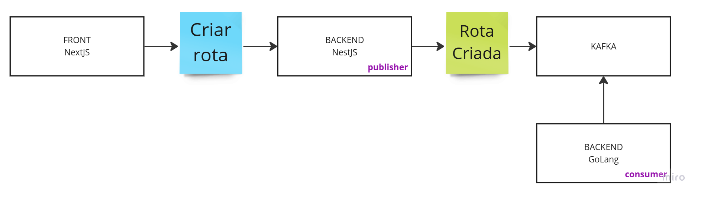
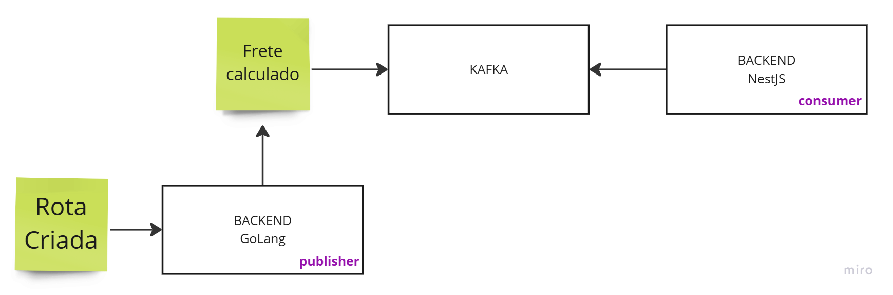
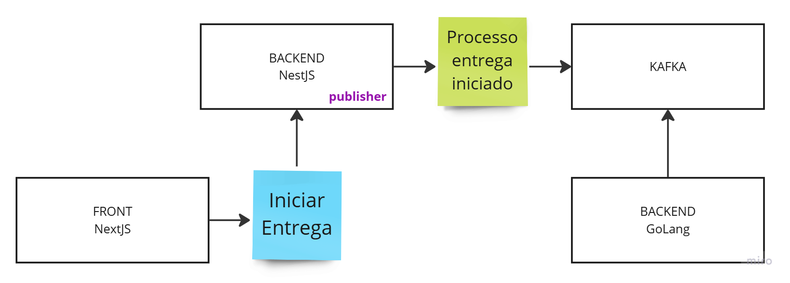
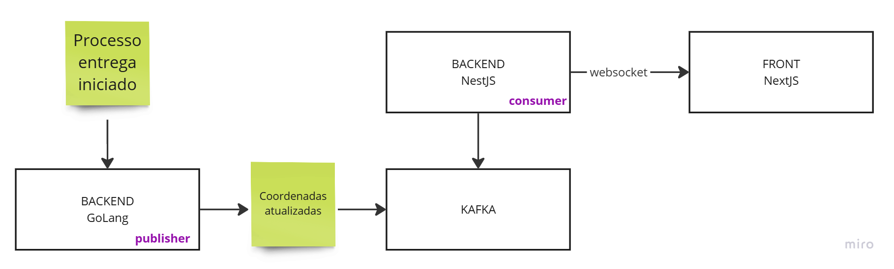
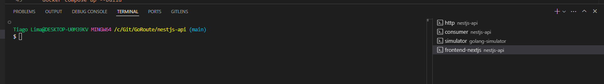

# GoRoute
Projeto de gerenciamento de rotas de entrega em tempo real, integrada ao Google Maps que fornece atualizações ao vivo, previsão de chegadas, monitoramento das entregas e calculo do frente. utilizando NestJS, NextJS, NodeJS, Typescript, ReactJS, GoLang, Apache Kafka, MongoDB, Websocket e TailwindCSS

# System Design

### Criação de novas rotas



### Calculo de frete



### Iniciar processo de entrega



### Simulação do processo de entrega



# How to start all the projects with Docker Compose



```docker compose up ```

run http api server

```docker compose exec nestjs sh && npm run start:dev ```

run consumer server

```docker compose exec nestjs sh && npm run start:dev -- --entryFile=cmd/kafka.cmd ```

run simulator server

```docker compose exec simulator sh && go run cmd/simulator/main.go ```

run nextjs frontend

```docker compose exec nextjs sh && npm run dev ```


or with --build to build all services

```docker compose up --build ```

# Control Center Kafka

running on port 9021

# NestJS

- Endpoint para capturar place id de um lugar no Google Maps
- Endpoint para traçar trajeto em 2 lugares
- Endpoint para criar rotas e persistir no MongoDB
- Integração com Google Maps API Directions

To run the project use the command below and running on port 3000

```cd nestjs-api && npm run start:dev```

All examples into **nestjs-api/api.http**

To run in Docker rede

```docker compose exec nestjs sh``` && ```npm run start:dev```

To run with repl

```npm run start:repl```

```docker compose exec -it simulator sh```

Ex: await get(RoutesService).findAll()

To run the consumer

```npm run start:dev -- --entryFile=cmd/kafka.cmd```

# NextJS

- Página de criação de rotas
- Página de trafegar rotas
- Páginade monitoramento de veículos
- Integração com API Backend NestJS
- Integração com Google Maps API

To run the project and running on port 3001

```cd frontend-nextjs && npm run dev``` 

# Go Lang

## Requerimentos

É necessário integrar com Google Maps, para isso, é necessário criar uma chave de API no Google Cloud Platform. Para isso, siga os passos:

1. Acesse o [Google Cloud Platform](https://cloud.google.com/).
2. Crie um novo projeto.
3. Ative a API do Places, Directions e Maps JavaScript do Google Maps.
4. Guarde a chave de API gerada.

## Rodar a aplicação

Gere o arquivo `.env` através do comando:

```
cp .env.example .env
```

Instale as dependências:

```bash
npm install
```

Rode o servidor:

```bash
npm run dev
```

# Events

**RouteCreated** (evento rota criada)

- id
- distance
- directions
  - lat
  - lng

**FreightCalculated** (evento frete calculado para tal rota criada)
- route_id
- amount

**DeliveryStarted** (evento de entrega iniciou)
- route_id

**DriverMoved** (evento do motorista se movimentando) -> é aqui que podemos adicionar um novo projeto de placa gps ao automóvel
- route_id
- lat
- lng


